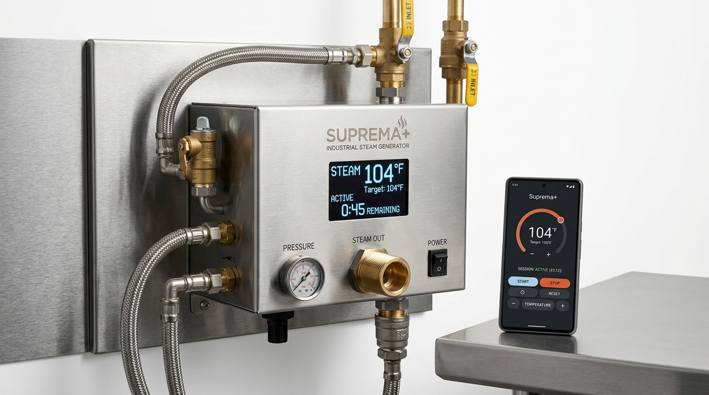

# Comprehensive Project Proposal & Commercial Strategy
## Suprema+ Smart Steam System
**A Premium, Connected Commercial Steam & Sauna Platform for Multi Technicaa**

---

### Executive Overview & Client Information

| Field | Details |
| :--- | :--- |
| **Client Organization** | **Multi Technicaa** |
| **Principal Stakeholder** | **Mr. Kirit B. Parmar** |
| **Location** | Thane / Bhayander, Mumbai, Maharashtra, India |
| **Product Line** | Commercial & Domestic Steam Bath Generators (SS/MS Series) |
| **Solution Name** | **Suprema+ Smart Steam System (BLE + Cloud/Gateway)** |
| **Prepared By** | **Devendra Vaja**, Founder & Principal Architect |
| **Consulting Firm** | **TenCore Digital Labs** (www.tencorelabs.com) |
| **Date of Submission** | 30 August 2026 / August 2026 |
| **Document Version** | **Version 1.0 (Proposal & Commercial Strategy)** |

---

## 1. Executive Summary & Market Opportunity

Multi Technicaa has established a premier reputation across Mumbai and the broader Indian market as a dependable, heavy-duty manufacturer of steam and sauna bath generators ranging across **3 kW to 22.5 kW+** (priced between **₹25,000 and ₹1,05,000**). Multi Technicaa machines are the trusted backbone for luxury gyms, fitness centers, resorts, boutique wellness spas, Ayurvedic panchakarma centers, and upscale residences.

### The Emerging Market Shift
Global and regional wellness technology leaders (e.g., **MrSteam SteamLinx**, **ThermaSol Solitude Mobile**, **Helo Control**, and **TOLO Sauna**) are redefining the commercial landscape. High-end hospitality developers, modern gym chains, and luxury homeowners now mandate:
- **Mobile Smartphone Control (iOS & Android)** via low-latency Bluetooth Low Energy (BLE).
- **Remote Pre-heating & Scheduled Sessions** for energy conservation.
- **Precision Atmosphere Controls**: Temperature, aroma/fragrance dispensing, session countdown, cool-off cycles, drain automation, and safety interlocks.
- **Multi-Room Commercial Centralized Management** for gym operators and resort facility managers.
- **Predictable Diagnostics & Proactive Maintenance Reminders**.

### The Strategic Opportunity for Multi Technicaa
Currently, Multi Technicaa commands strong hardware loyalty on engineering reliability and after-sales service. However, without a dedicated smart ecosystem, commercial bids are exposed to price erosion from low-cost assemblers, while premium hospitality tenders are captured by international brands charging 2x–3x premiums.

**The Suprema+ Strategy:**
By introducing the **Suprema+ Smart Steam System**, Multi Technicaa will:
1. **Transform into a Connected Smart Wellness Brand**: Move from pure hardware manufacturing to an integrated hardware + software ecosystem.
2. **Command a 20%–30% Higher Average Selling Price (ASP)**: Justify an uplift of **₹15,000 to ₹20,000 per unit**.
3. **Dominate Commercial Tenders**: Provide gym chains and resorts with multi-unit management tools that low-cost competitors cannot match.
4. **Create High-Margin Recurring Revenue**: Unlock optional cloud monitoring, service contracts, and facility analytics.

---

## 2. The Solution: Suprema+ Smart Steam System


*Figure 1: Conceptual visual of the Suprema+ Industrial Steam Bath Generator with digital display and paired smartphone BLE control application.*

Suprema+ is engineered as an end-to-end smart solution consisting of three tightly integrated layers:

```
┌────────────────────────────────────────────────────────────────────────┐
│                        SUPREMA+ MOBILE APP                             │
│       (Flutter iOS & Android - Bluetooth Low Energy + Wi-Fi Ready)      │
│  • Single-touch Start/Stop    • Temperature & Timer Presets             │
│  • Ambience & Aroma Controls  • Multi-Unit Room Switcher (Gyms/Spas)   │
│  • Real-Time Telemetry & Safe Fault Diagnostics                         │
└───────────────────────────────────┬────────────────────────────────────┘
                                    │ BLE 5.0 / GATT Binary Protocol
┌───────────────────────────────────▼────────────────────────────────────┐
│                  SUPREMA+ SMART CONTROLLER (HARDWARE)                   │
│   • Industrial MCU (nRF52840 / ESP32-C3/S3 Architecture)                │
│   • Optocoupled Relays, Dual Thermistor Probes, Water Level Sensors    │
│   • Auto-Drain Valve Driver & Safety Lockout Interlocks                │
└───────────────────────────────────┬────────────────────────────────────┘
                                    │ High-Voltage Power Stage
┌───────────────────────────────────▼────────────────────────────────────┐
│             MULTI TECHNICAA STEAM GENERATOR (3kW - 22.5kW)             │
│   • Heavy-Duty SS304/SS316 Boiler Tank & Heating Elements              │
└────────────────────────────────────────────────────────────────────────┘
```

### Key Solution Capabilities

- **Frictionless BLE Pairing & Fast Reconnect**: Instant, sub-second smartphone connection within 15–30 meters without requiring home Wi-Fi credentials or cellular networks.
- **Comprehensive Session Control**: Start/Stop, target temperature (35°C–55°C), duration timer (5–90 min), pre-heat boost, and cool-off cycle.
- **Advanced Machine Settings**: Ambience temp calibration, auto-drain duration, descaling cycle trigger, buzzer alarm toggle, and BLE discovery controls.
- **Live Visual Telemetry**: Real-time state machine display (Idle → Filling → Heating → Steaming → Cooling → Draining → Descaling → Error Lockout).
- **Multi-Unit Facility Dashboard**: Seamless switching between multiple rooms (e.g., "Men's Steam Room", "Women's Spa 1", "VIP Suite") from a single screen.
- **Safety-First Fault Handling**: Hardware-enforced interlocks for over-temperature, dry run detection, probe sensor failure, and emergency stop ACK.
- **Future Scale**: Pre-architected for Bluetooth Mesh multi-panel sync and an optional plug-and-play Wi-Fi Gateway for remote cloud access.

---

## 3. Business Case & ROI Analysis

The transition to Suprema+ creates a compelling return on investment for Multi Technicaa:

### Unit Economics & Price Uplift (12 kW Model Example)
- **Standard 12 kW Unit Selling Price:** ~₹50,000
- **Suprema+ 12 kW Smart Unit Target Price:** **₹65,000 – ₹70,000**
- **Incremental Value Uplift (ASP Expansion):** **₹15,000 – ₹20,000 per unit**

### Break-Even & Profit Realization
- **Total Software & Systems Engineering Investment:** ₹30 Lakhs – ₹50 Lakhs (amortized over production volume).
- **Break-Even Volume:** Only **2,000 – 3,000 premium units** over 2–3 years.
- At an annual commercial volume of **500 – 800 units/year**, Suprema+ pays for itself rapidly while elevating Multi Technicaa's overall brand equity and tender win rate.

---

## 4. Hardware & Electronics Context (PCB BOM)

To understand the software investment in context, let us review the estimated electronics and bill-of-materials (BOM) cost per Suprema+ generator unit:

### Estimated Per-Unit Electronics BOM
| Component / Subsystem | Indicative Cost (per unit) | Notes |
| :--- | :--- | :--- |
| **BLE 5.0 Module** | ₹250 – ₹600 | Nordic nRF52840 or Espressif ESP32-C3/S3 (volume-tiered) |
| **Main MCU, Power Supply & Industrial Housing** | ₹400 – ₹800 | Regulated 12V/5V DC stage, transient suppression, enclosure |
| **Display, Capacitive Buttons & Wire Harness** | ₹600 – ₹1,500 | Digital temperature display, status LEDs, industrial harness |
| **PCB Assembly, SMT & Vendor Margin** | ₹400 – ₹800 | Wave soldering, conformal coating, QA testing |
| **Total Electronics BOM per Unit** | **₹1,650 – ₹3,700** | Scalable based on production batch sizes |

### Annual Electronics Program Spend Comparison
- At **1,000 units/year**: ₹16.5 Lakhs – ₹37.0 Lakhs/year in hardware spend.
- At **3,000 units/year**: ₹49.5 Lakhs – ₹1.11 Crores/year in hardware spend.

> **Key Takeaway:** A software engineering investment of **₹45 Lakhs** represents only a modest portion of the broader production program, which is fully amortized across early production runs while yielding permanent, reusable software IP.

---

## 5. Optional Add-On: Embedded Systems Consulting & BLE Protocol Design

**Investment:** **₹4,00,000 (₹4.0 Lakhs)** — *One-time engineering sprint prior to Phase 1.*

### What is Included in this Engagement:
1. **Custom BLE GATT Profile Architecture**:
   - Master Service UUID and Characteristic UUID mapping (Control, Telemetry, Configuration, Safety).
   - Read / Write / Notify / Indicate property definitions and MTU size optimization.
2. **Binary Frame Protocol Specification**:
   - Structured command frames (Header, Opcode, Sequence ID, Payload Length, CRC-16 Checksum).
   - Comprehensive error and status response matrices.
3. **Safety & Hardware Interlock Rules**:
   - Hardware-level validation criteria, fail-safe disconnect behavior, and emergency cutoff triggers.
4. **Virtual Firmware Simulator Specification**:
   - Software state machine simulator allowing rapid mobile app development ahead of physical PCB fabrication.
5. **Joint Technical Review Workshops**:
   - 2 to 3 collaborative engineering reviews with Multi Technicaa's hardware engineering partners.

### Why this is a Distinct Engineering Add-On:
- This is specialized **Embedded Systems Architecture & Protocol Engineering**, independent of frontend mobile development.
- It generates **permanent intellectual property** 100% owned by Multi Technicaa, reusable across future touchscreens, gateways, and vendor boards.

### Decision Check:
- **Include Add-On (+₹4,00,000):** TenCore Digital Labs architects and validates the complete BLE communication protocol.
- **Skip Add-On:** Multi Technicaa's electronics team provides a finalized, documented BLE GATT protocol specification before Phase 1 kickoff.

---

## 6. Detailed 4-Phase Implementation Roadmap & Payment Milestones

The project is structured into **4 distinct, milestone-gated phases** spanning 30–38 weeks, designed to manage cash flow and tie every payment to verifiable deliverables:

```
┌─────────────────┐    ┌─────────────────┐    ┌─────────────────┐    ┌─────────────────┐
│     PHASE 1     │    │     PHASE 2     │    │     PHASE 3     │    │     PHASE 4     │
│  Discovery &    │───>│    MVP Core     │───>│   Commercial    │───>│ Scale & Cloud/  │
│    Prototype    │    │   Development   │    │    Readiness    │    │  Wi-Fi Gateway  │
│   (4-6 Weeks)   │    │  (8-10 Weeks)   │    │  (8-10 Weeks)   │    │  (10-12 Weeks)  │
│     ₹6.0 L      │    │     ₹12.0 L     │    │     ₹15.0 L     │    │     ₹12.0 L     │
└─────────────────┘    └─────────────────┘    └─────────────────┘    └─────────────────┘
```

---

### Phase 1 – Discovery & Functional Prototype
- **Duration:** 4 – 6 Weeks
- **Target Budget:** **₹6,00,000** *(or ₹10,00,000 if BLE Protocol Add-On is selected)*
- **Detailed Scope:**
  - Architecture sign-off & BLE GATT specification review.
  - Development of prototype Flutter app (iOS & Android).
  - Core connection engine: BLE Discovery, Pairing, Start/Stop, Temp/Timer set, Live status readout.
  - End-to-end testing with initial hardware prototype or firmware simulator.
  - Closed pilot feedback evaluation with 2–3 commercial gym/resort partners.
- **Payment Milestones (Phase 1):**
  - **40% on Kickoff:** ₹2,40,000 *(or ₹4,00,000 with Protocol Add-On)*
  - **40% on Working Prototype Demo:** ₹2,40,000 *(or ₹4,00,000 with Protocol Add-On)*
  - **20% on Pilot Report & Phase 2 Go/No-Go:** ₹1,20,000 *(or ₹2,00,000 with Protocol Add-On)*
- **Outcome:** Validated working mobile app communicating live with steam generator hardware.

---

### Phase 2 – MVP Core System Development
- **Duration:** 8 – 10 Weeks
- **Target Budget:** **₹12,00,000**
- **Detailed Scope:**
  - Complete cross-platform production application codebase (iOS & Android).
  - Multi-unit management interface for commercial multi-room facilities.
  - Advanced parameter controls (Ambience offset, cool-off timer, drain interval, buzzer volume).
  - Diagnostic fault engine (sensor disconnected, overheating, water level error, communication timeout).
  - Comprehensive field testing on test benches and production steam units.
- **Payment Milestones (Phase 2):**
  - **30% on Phase 2 Kickoff:** ₹3,60,000
  - **40% on Beta App & Integrated Hardware Build:** ₹4,80,000
  - **30% on MVP Core Acceptance Sign-off:** ₹3,60,000
- **Outcome:** Production-grade core application ready for commercial customer installation.

---

### Phase 3 – Commercial Readiness & Pilot Rollout
- **Duration:** 8 – 10 Weeks
- **Target Budget:** **₹15,00,000**
- **Detailed Scope:**
  - UI/UX polish, micro-animations, branded onboarding flows, and offline fallback resiliency.
  - Preventive maintenance scheduler (descaling alerts, element run-hour counter).
  - App Store & Google Play submission packages (assets, privacy policy, compliance testing).
  - Controlled commercial pilot rollout across 5–10 active client installations.
- **Payment Milestones (Phase 3):**
  - **30% on Phase 3 Kickoff:** ₹4,50,000
  - **40% on Feature-Complete Release Candidate:** ₹6,00,000
  - **30% on Final Pilot Validation & Acceptance:** ₹4,50,000
- **Outcome:** Polished, store-ready Suprema+ system deployed in commercial live environments.

---

### Phase 4 – Scale, Wi-Fi Gateway & Cloud Ecosystem (Optional)
- **Duration:** 10 – 12 Weeks
- **Target Budget:** **₹12,00,000**
- **Detailed Scope:**
  - Wi-Fi IoT Gateway integration for remote out-of-building scheduling & pre-heat.
  - Cloud synchronization and centralized multi-site administrative web portal.
  - Advanced usage analytics, energy optimization insights, and fleet telemetry.
- **Payment Milestones (Phase 4):**
  - **30% on Phase 4 Kickoff:** ₹3,60,000
  - **40% on Feature-Complete Gateway Integration:** ₹4,80,000
  - **30% on Final Field Deployment & Cloud Sign-off:** ₹3,60,000
- **Outcome:** Full enterprise smart wellness cloud suite competing with global leaders.

---

## 7. Investment Summary & Cash Flow Schedule

### Base Comparison: App-Only vs. Full Solution

| Project Phase | Focus Area | Scenario 1: App Only | Scenario 2: Full Solution (w/ BLE Protocol) |
| :--- | :--- | :--- | :--- |
| **Phase 0** | BLE Protocol Design & Embedded Consulting | *Provided by Client* | **₹4,00,000** |
| **Phase 1** | Discovery & Functional Prototype | ₹6,00,000 | **₹6,00,000** |
| **Phase 2** | MVP Core Application & Firmware Link | ₹12,00,000 | **₹12,00,000** |
| **Phase 3** | Commercial Readiness & Pilot Rollout | ₹15,00,000 | **₹15,00,000** |
| **Phase 4** | Scale, Wi-Fi Gateway & Cloud Portal | ₹12,00,000 | **₹12,00,000** |
| **Total Program Investment** | | **₹45,00,000** | **₹49,00,000** |

### Projected Cash Flow Timeline (Scenario 2 Example)
- **Month 0 – 1 (Protocol Engineering):** ₹4,00,000
- **Month 1 – 2.5 (Phase 1 Prototype):** ₹6,00,000
- **Month 2.5 – 5 (Phase 2 MVP Core):** ₹12,00,000
- **Month 5 – 7.5 (Phase 3 Commercial Rollout):** ₹15,00,000
- **Month 8 – 11 (Phase 4 Cloud/Gateway):** ₹12,00,000

### Ancillary Store & Distribution Costs
- **Google Play Console Developer Account:** $25 one-time (~₹2,100).
- **Apple Developer Program Organization Account:** $99 / year (~₹8,400/year).
- **Direct Sideloading (B2B):** Android APK distribution for gym facility engineers without mandatory Play Store listing; Apple TestFlight/Business Manager for iOS enterprise pilots.

---

## 8. Strategic Deal Structures & Commercial Options

To provide Multi Technicaa with maximum financial flexibility and align incentives, TenCore Digital Labs presents **three distinct commercial engagement models**:

```
┌────────────────────────────────────────────────────────────────────────┐
│                        CHOOSE YOUR DEAL MODEL                          │
├──────────────────┬───────────────────────┬─────────────────────────────┤
│     OPTION 1     │       OPTION 2        │          OPTION 3           │
│ 4-Phase Fixed    │ Lower Upfront +       │ Joint Product Model         │
│ Milestone Fee    │ Per-Unit Royalty      │ (Margin / Uplift Share)     │
│                  │                       │                             │
│ ₹45L / ₹49L      │ ₹30L Upfront +        │ ₹30L Upfront +              │
│ 100% Fixed Cost  │ ₹750/unit Royalty     │ 15% Price Uplift Share      │
│ Zero Royalties   │ (Cap: ₹15L)           │ (Cap: ₹15L)                 │
└──────────────────┴───────────────────────┴─────────────────────────────┘
```

---

### Option 1: 4-Phase Fixed-Fee Model (Predictable Investment)

- **Structure:** Direct milestone-based fixed-fee contract across all 4 phases totaling **₹45,00,000** (or **₹49,00,000** with BLE Protocol Add-On).
- **How it Works:** Multi Technicaa funds development through milestone tranches. Upon completion, Multi Technicaa owns the full application with **zero ongoing royalties or licensing fees**.
- **Ideal For:** Multi Technicaa if you prefer predictable budgeting, fixed CAPEX, and 100% unencumbered software ownership.
- **Executive Pitch:**
  > *"You invest a clear, fixed total of ₹45L across small milestone tranches as we build and deliver each phase. You retain 100% of all future margins, with zero royalties and zero surprises."*

---

### Option 2: Lower Upfront + Per-Unit Royalty Model (Shared Risk)

- **Structure:** Reduced upfront engineering cost during Phases 1–3, paired with a modest per-unit success royalty once Suprema+ generators are shipped.
- **Financial Architecture:**
  - **Upfront Development (Phases 1–3):** **₹30,00,000**
    - Phase 1: ₹6,00,000
    - Phase 2: ₹10,00,000
    - Phase 3: ₹14,00,000
  - **Per-Unit Royalty:** **₹750 per Suprema+ unit sold**, capped at **2,000 units** (Max Royalty Cap: **₹15,00,000**).
  - **Maximum Total Program Cost:** ₹30,00,000 + ₹15,00,000 = **₹45,00,000**.
  - Once 2,000 units are shipped, royalty ceases completely (or transitions to a nominal maintenance fee).
- **Alternative Royalty Tier Options:**
  - *Ultra Cash-Light:* ₹25L upfront + ₹1,000/unit royalty (Cap ₹20L).
  - *Balanced:* ₹35L upfront + ₹500/unit royalty (Cap ₹10L).
- **Ideal For:** Multi Technicaa if managing upfront cash flow is a priority while linking our compensation directly to unit sales volume.
- **Executive Pitch:**
  > *"Instead of paying ₹45L upfront, you only pay ₹30L during development and contribute ₹750 per machine as Suprema+ units are sold in the market. If you sell fewer units, your total cost is lower; if you sell 2,000 units, the cost caps at the exact same ₹45L. Our success is 100% aligned with your sales."*

---

### Option 3: Joint Product Approach (Shared Margin Uplift)

- **Structure:** Treat Suprema+ as a co-engineered premium flagship line. TenCore Digital Labs discounts upfront development in exchange for a small percentage of the **incremental price premium (uplift)** generated by Suprema+.
- **Financial Architecture:**
  - **Standard 12 kW Price:** ₹50,000
  - **Suprema+ 12 kW Target Price:** ₹68,000
  - **Incremental Uplift Earned by Multi Technicaa:** ₹18,000 per unit
  - **Upfront Development Investment:** **₹30,00,000**
  - **Revenue Share on Uplift:** **15% of the ₹18,000 price premium = ₹2,700 per unit** for 3 years, capped at **₹15,00,000** (~5,556 units).
  - **Maximum Total Program Cost:** ₹30,00,000 + ₹15,00,000 = **₹45,00,000**.
- **Ideal For:** Multi Technicaa if you desire a long-term strategic technology partner invested in product optimization, premium branding, and continuous commercial success.
- **Executive Pitch:**
  > *"We treat Suprema+ as a joint flagship product. You pay ₹30L during development, and we take 15% of the extra profit margin you earn on each smart unit, capped at ₹15L. We only earn our upside from the new profit we create together."*

---

## 9. Deal Comparison & Decision Matrix

| Dimension | Option 1: Fixed Fee | Option 2: Unit Royalty | Option 3: Joint Product |
| :--- | :--- | :--- | :--- |
| **Upfront Cash Commitment** | ₹45.0 L (or ₹49.0 L) | **₹30.0 L** (or ₹34.0 L) | **₹30.0 L** (or ₹34.0 L) |
| **Ongoing Payment** | None (₹0) | ₹750 per unit sold | 15% of price uplift (₹2,700/unit) |
| **Total Cost Ceiling** | ₹45.0 Lakhs | **₹45.0 Lakhs (Capped)** | **₹45.0 Lakhs (Capped)** |
| **Cash-Flow Risk** | Borne by Client | Shared across Sales | Shared across Value Creation |
| **Vendor Alignment** | Fixed Scope Delivery | High (Tied to Shipments) | Highest (Tied to Pricing & Margin) |
| **Best Fit When...** | Client wants fixed CAPEX | Client is cash-conscious | Client seeks a long-term tech partner |

---

## 10. Strategic Next Steps & Immediate Kickoff

To initiate the Suprema+ program and achieve working prototype validation rapidly:

1. **Internal Review with Electronics Team**:
   - Review this proposal and decide whether to include the **BLE Protocol Design Add-On (₹4,00,000)** or provide an existing finalized GATT specification.
2. **Select Preferred Financial Model**:
   - Select between **Option 1 (Fixed Fee)**, **Option 2 (Per-Unit Royalty)**, or **Option 3 (Joint Product)**.
3. **Approve Phase 1 Kickoff**:
   - Execute the Phase 1 statement of work (**₹6,00,000** or **₹10,00,000** with protocol design) with a 40% initial tranche.
4. **Initiate Sprints**:
   - Conduct Sprint 1 architecture workshop and begin prototype Flutter app development.

---

## 11. Contact Information & Engineering Leadership

For technical discussions, commercial clarifications, and project kickoff:

```
┌────────────────────────────────────────────────────────────────────────┐
│                        TENCORE DIGITAL LABS                            │
│                  Deep Tech & Connected Systems Engineering             │
├────────────────────────────────────────────────────────────────────────┤
│                                                                        │
│   Devendra Vaja                                                        │
│   Founder & Principal Architect                                        │
│   TenCore Digital Labs                                                 │
│                                                                        │
│   📍 Mumbai, Maharashtra, India                                        │
│   📧 Email: tencorelabs@gmail.com                                      │
│   🌐 Web: www.tencorelabs.com                                          │
│   🔗 LinkedIn: https://www.linkedin.com/in/devendra-vaja/              │
│   📱 Founder Profile: https://tencorelabs.com/pages/know-the-founder    │
│                                                                        │
└────────────────────────────────────────────────────────────────────────┘
```

---
*Multi Technicaa – Suprema+ Smart Steam System Proposal © 2026 TenCore Digital Labs. All Rights Reserved.*
